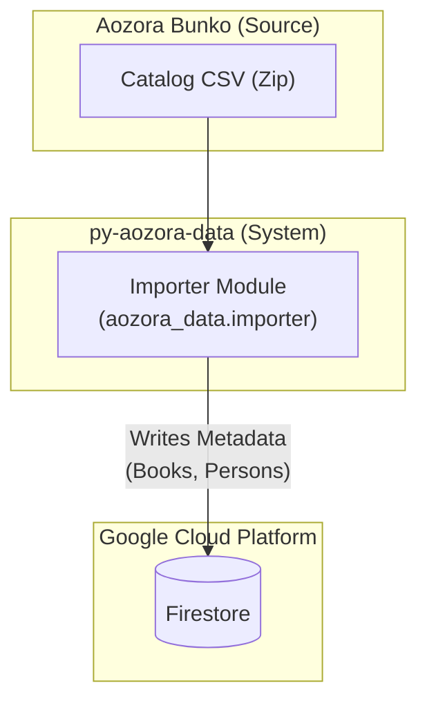
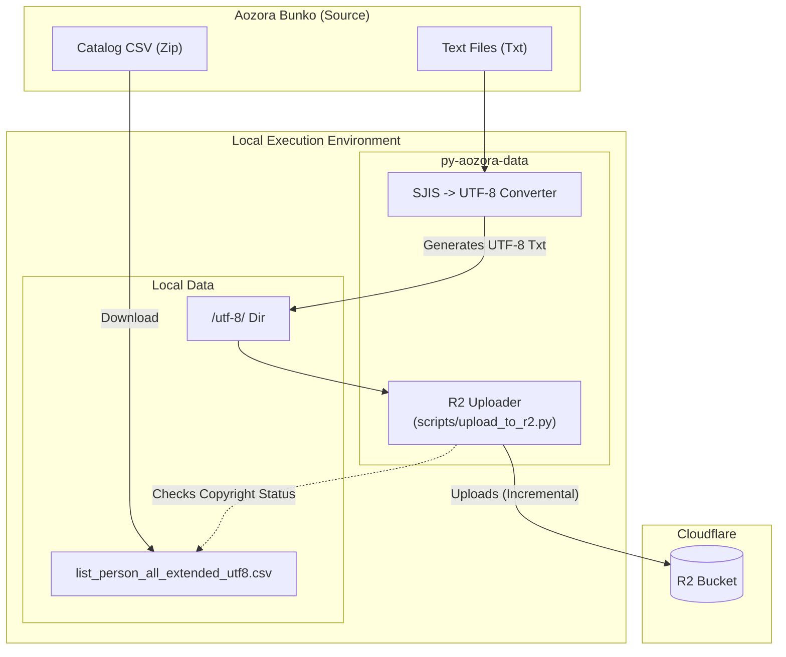

# System Architecture

## Overview

`py-aozora-data` facilitates the ingestion and hosting of Aozora Bunko data. It serves two main purposes:
1.  **Metadata Management**: Importing catalog information (CSV) into Google Cloud Firestore.
2.  **Content Delivery**: Uploading the actual text content of books to Cloudflare R2 for efficient distribution.

## Architecture Diagrams

### Metadata Pipeline

### Content Pipeline

## Components

### 1. Metadata Importer (`aozora_data.importer`)
-   **Source**: Downloads `list_person_all_extended_utf8.zip` from Aozora Bunko.
-   **Logic**: Parses the CSV to extract book and author information. Performs differential updates to minimize database writes.
-   **Destination**: Google Cloud Firestore.
    -   `books` collection
    -   `persons` collection
    -   `contributors` collection

### 2. File Converter & Uploader
-   **Conversion**: Converts legacy Shift-JIS text files to UTF-8.
-   **Storage**: Uploads processed text files to Cloudflare R2.
-   **Script**: `scripts/upload_to_r2.py`
    -   **Incremental Upload**: Checks MD5 checksums to avoid re-uploading unchanged files.
    -   **Copyright Filtering**: Filters out works that are still under copyright using flags from the catalog CSV.
    -   **Audit Mode**: Verifies existing files in R2 against the allowed copyright list.

## Data Flow

1.  **Metadata Sync**: Run the importer to populate Firestore with the latest catalog data.
2.  **Content Prep**: Convert local Shift-JIS files to UTF-8 (using `convert_all.py` or similar).
3.  **Content Sync**: Run `upload_to_r2.py` to sync the UTF-8 files to Cloudflare R2, ensuring only copyright-free material is hosted publically.
